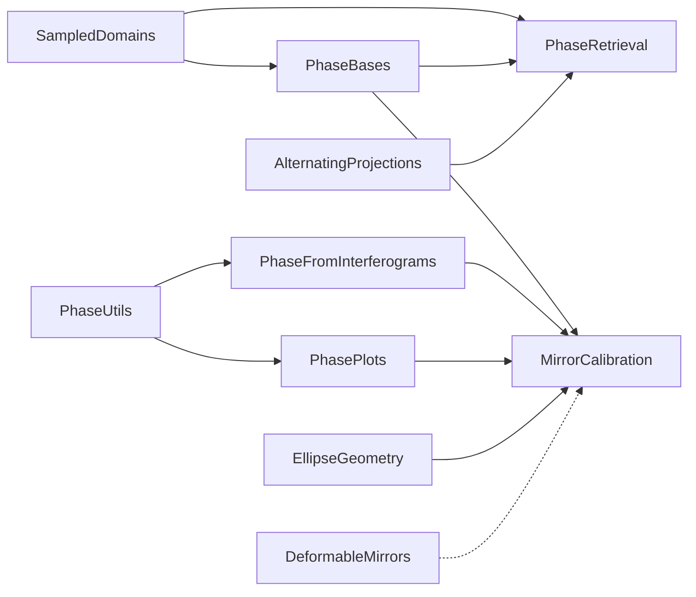

# Phase.jl

<!-- badges: Docs | DOI (Zenodo, add after first release) | License -->
[](https://juliaphase.github.io/Phase.jl/dev/)

**Julia packages for optical phase retrieval, wavefront representation, interferometry, and adaptive optics.**

Phase.jl is the entry point to the [JuliaPhase](https://github.com/JuliaPhase) ecosystem: a family of small,
composable packages for working with the phase of an optical field. They cover the whole chain
from sampling grids and Zernike bases to phase retrieval algorithms, interferogram processing and
deformable-mirror calibration. Each package does one thing and can be used on its own; together
they take you from a measured intensity or interferogram to a mirror command.

> **Status.** This repository is currently the hub of the ecosystem: overview, joint documentation,
> citation and funding. In the future `Phase.jl` will also become a meta-package that loads and
> re-exports the core packages, so that `using Phase` gives you the whole toolbox (see [Roadmap](#roadmap)).

## Packages

### Foundations

| Package | What it does | Status |
|---|---|---|
| [SampledDomains.jl](https://github.com/JuliaPhase/SampledDomains.jl) | Sampled 2D Cartesian domains and their Fourier-dual grids | experimental |
| [PhaseUtils.jl](https://github.com/JuliaPhase/PhaseUtils.jl) | Common helpers: phase wrapping, apertures and masks, masked RMS errors, tilts, thresholding | active |
| [PhaseBases.jl](https://github.com/JuliaPhase/PhaseBases.jl) | Pupil phase bases (Zernike polynomials, Gaussian radial basis functions) precomputed on a grid for fast repeated evaluation | active |

### Algorithms

| Package | What it does | Status |
|---|---|---|
| [AlternatingProjections.jl](https://github.com/JuliaPhase/AlternatingProjections.jl) | Alternating projection algorithms (Gerchberg–Saxton, DRAP, …) written close to their mathematical form | experimental |
| [PhaseRetrieval.jl](https://github.com/JuliaPhase/PhaseRetrieval.jl) | Phase retrieval from intensity (point-spread function) measurements | experimental |
| [PhaseFromInterferograms.jl](https://github.com/JuliaPhase/PhaseFromInterferograms.jl) | Phase extraction from interferograms by Fourier methods (first-harmonic selection, zeroth-order removal, tilt estimation) | active |
| [CircleMedianFilter.jl](https://github.com/JuliaPhase/CircleMedianFilter.jl) | Fast edge-preserving median filtering for circular data (wrapped phase, orientation fields) | active |

### Adaptive optics and hardware

| Package | What it does | Status |
|---|---|---|
| [DeformableMirrors.jl](https://github.com/JuliaPhase/DeformableMirrors.jl) | Models of deformable mirrors (piezoelectric and micromachined): actuator geometry, apertures | experimental |
| [MirrorCalibration.jl](https://github.com/JuliaPhase/MirrorCalibration.jl) | Interferometric calibration of deformable mirrors: recording, processing and inspecting influence functions | experimental |

### Geometry and visualization

| Package | What it does | Status |
|---|---|---|
| [EllipseGeometry.jl](https://github.com/JuliaPhase/EllipseGeometry.jl) | Ellipses: representation, fitting and geometry (for pupils and apertures) | active |
| [PhasePlots.jl](https://github.com/JuliaPhase/PhasePlots.jl) | Plotting of phase maps and tables of heatmaps (Makie) | active |

## How the packages fit together



## Installation

The packages are not yet in the Julia General registry. Install the ones you need directly from GitHub:

```julia
using Pkg
Pkg.add(url = "https://github.com/JuliaPhase/SampledDomains.jl")
Pkg.add(url = "https://github.com/JuliaPhase/PhaseBases.jl")
```

## Roadmap

1. **Now:** a joint documentation site for all packages (MultiDocumenter.jl) and a Zenodo DOI for
   every release.
2. **Next:** register the core packages in the Julia General registry.
3. **Then:** turn `Phase.jl` into a meta-package that re-exports the core (SampledDomains, PhaseUtils,
   PhaseBases, AlternatingProjections, PhaseRetrieval, PhaseFromInterferograms). Heavy or
   hardware-specific packages (PhasePlots/Makie, MirrorCalibration, DeformableMirrors) stay separate,
   so that `using Phase` loads fast.

## Citing

If you use these packages in your research, please cite Phase.jl and the specific packages you use.
Every release is archived on Zenodo with a DOI; see `CITATION.cff` in each repository.
<!-- add the Phase.jl concept DOI here after the first Zenodo release -->

## Funding

Parts of this work were developed at [OKO Technologies](https://www.okotech.com) (Flexible Optical B.V.)
within the following projects:

- [**MADEin4**](https://madein4.eu/) received funding from the ECSEL Joint Undertaking (JU) under grant
  agreement No [826589](https://cordis.europa.eu/project/id/826589). The JU receives support from the
  European Union's Horizon 2020 research and innovation programme and France, Germany, Austria, Italy,
  Sweden, Netherlands, Belgium, Hungary, Romania and Israel.
- [**14AMI**](https://www.14ami.eu/) received funding from the Chips Joint Undertaking (JU) under grant
  agreement No [101111948](https://doi.org/10.3030/101111948). The JU receives support from the
  European Union's Horizon Europe research and innovation programme and <!-- verify: participating states -->.

<p>
  
  
  
</p>
<!-- files from _org/logos/; Chips-JU.png already contains the "Co-funded by the European Union" emblem -->

## Maintainer

[Oleg Soloviev](https://github.com/olejorik) </br>
ORCID: https://orcid.org/0000-0003-3761-9192

## License

[MIT](LICENSE)
